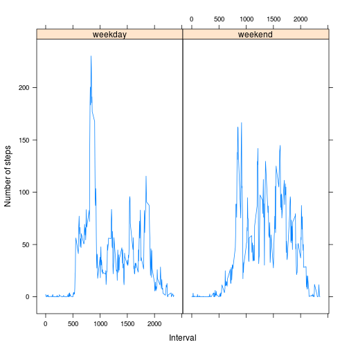

## Loading and preprocessing the data

We obtain the data from the course website and transform the column to the appropiate types. 


```r
download.file('https://d396qusza40orc.cloudfront.net/repdata%2Fdata%2Factivity.zip', 'repdata.zip', 'wget')
unzip("repdata.zip")
act <- read.csv('activity.csv', header=T)
act$date <- strptime(act$date, '%Y-%m-%d')
act$date <- as.Date(act$date)
```

## What is mean total number of steps taken per day?
Then, we calculate the mean and the median. 


```r
mean(act$steps, na.rm=T)
```

```
## [1] 37.3826
```

```r
median(act$steps, na.rm=T)
```

```
## [1] 0
```

### What is the average daily activity pattern?

We calculate the average number of steps taken for each interval across all  days. 


```r
steps.by.interval <- aggregate(steps ~ interval, data=act, mean)
with(steps.by.interval, plot(steps ~ interval, type='l'))
```

 

```r
steps.by.interval[steps.by.interval$steps == max(steps.by.interval$steps),1 ]
```

```
## [1] 835
```

The 5-minute interval number 835 contains, on average, the maximum number of steps.

## Imputing missing values

There are a number of days/intervals where there are missing values (coded as NA). The presence of missing days may introduce bias into some calculations or summaries of the data. Therefore, we replace the missing values of steps with its mean grouped by interval. But first, we calculate the total number of missing values.

    

```r
t <- is.na(act)
df <- (t[,1] | t[,2] | t[,3])
length(which(df))
```

```
## [1] 2304
```

Then, the function 'fill.na' iterates through our dataset and stores the values of the 'step' column, where NA's have been replaced by the mean step for that interval. 
    

```r
mean.by.day <- aggregate(act$steps, by=list(interval = act$interval), mean, na.rm=TRUE)

fill.na <- function(activity) {
  #if na, return mean, else return value
  if (is.na(activity['steps'])) {
    return (as.numeric(mean.by.day[(mean.by.day$interval == activity['interval']), 2]))
  }
  return (activity['steps'])
}

newsteps <- apply(act[, c('steps', 'interval')], 1, FUN=fill.na)

#SIMPLER SOLUTION:
#act$steps[is.na(act$steps)] <- with(act, ave(steps, 
#                                             interval, 
#                                             FUN=function(x) mean(x, na.rm=T)))[is.na(act$steps)] 
act2 <- act
act2$steps <- newsteps
```

We make a histogram of the total number of steps taken each day and Calculate and report the mean and median total number of steps taken per day. 
    

```r
stepsxday <- aggregate(act2$steps, by=list(Date = act2$date), sum)
hist(stepsxday$x)
```

 

```r
mean(act2$steps)
```

```
## [1] 37.3826
```

```r
median(act2$steps)
```

```
## [1] 0
```

## Are there differences in activity patterns between weekdays and weekends?

We create a new factor variable in the dataset with two levels – “weekday” and “weekend” indicating whether a given date is a weekday or weekend day.


```r
is.weekend <- function (fecha) {
  if ((weekdays(fecha) =='sábado') | (weekdays(fecha) =='domingo')) {
    return ('weekend')
  }
  return ('weekday')
}  

act2$weekday <- factor(c('weekday', 'weekend'))
act2$weekday <- sapply(act2$date,  FUN=is.weekend)
```

We then make a panel plot containing a time series plot (i.e. type = "l") of the 5-minute interval (x-axis) and the average number of steps taken, averaged across all weekday days or weekend days (y-axis). 
    

```r
library(lattice)
steps.by.interval <- with(act2, aggregate(steps, by=list(Interval = interval, WDay = weekday), data = act2, FUN=mean))
with(steps.by.interval, xyplot(x ~ Interval|WDay, type='l', ylab="Number of steps"))
```

 

